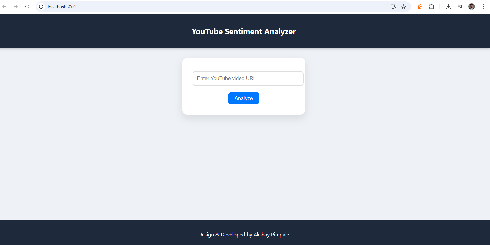
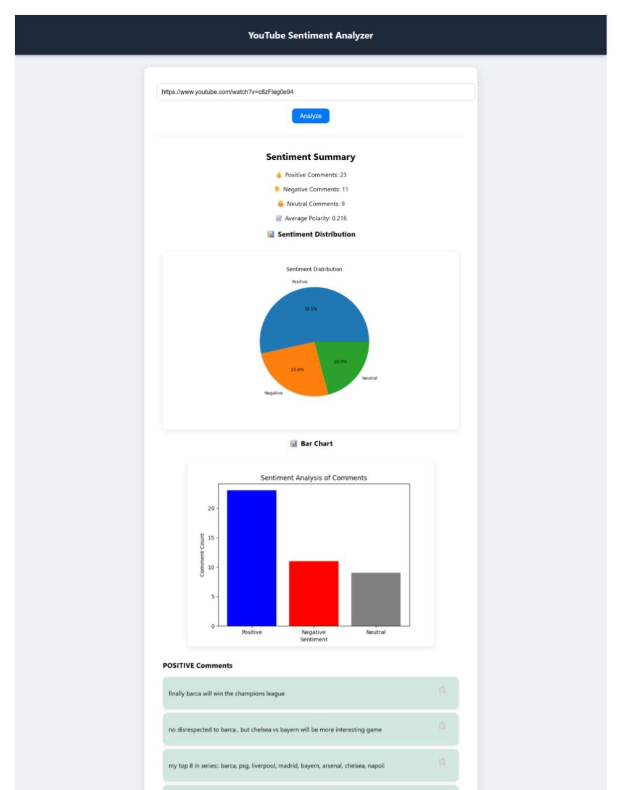

# 🧠 Sentiment Analysis System

A machine learning–powered web application for **analyzing sentiments** from text and YouTube comments. Built with **Python (Flask backend)** and **React.js (frontend)**. The app classifies text into **Positive**, **Negative**, or **Neutral** sentiments and provides an interactive UI for batch analysis of YouTube comments.

---

## 🚀 Features

* **Sentiment Classification** — Classifies input text and YouTube comments into positive / negative / neutral.
* **Interactive Frontend** — React.js UI for a responsive user experience.
* **YouTube Comments Analysis** — Extract and analyze comments from YouTube videos in batch mode.
* **Custom ML Model** — Local model script (`sentiment.py`) used for inference.
* **REST API** — Flask backend exposing endpoints for the frontend.
* **Demo Output** — Screenshots and sample outputs included.

---

## 🛠️ Tech Stack

**Frontend**

* React.js (Hooks & component architecture)
* HTML, CSS (responsive styling)

**Backend**

* Python 3.x
* Flask

**Machine Learning**

* scikit-learn / custom NLP scripts

**Other**

* Example data: `ytcomments.txt`
* Virtual environment for Python (`venv`)

---

## 📸 Demo Output

   


---


## 📂 Project Structure

```
Sentiment-Analysis-System/
├── backend/
│   ├── app.py                 # Flask app (API backend)
│   ├── sentiment.py           # ML model script (inference)
│   ├── requirements.txt       # Python dependencies
│   ├── ytcomments.txt         # Sample dataset for YouTube comments
│   ├── admin pannel prompt.txt# Notes / prompts
│   ├── code.txt               # Extra snippets / notes
│   └── venv/                  # Virtual environment (should be in .gitignore)
│
├── frontend/
│   ├── public/
│   │   ├── favicon.ico
│   │   ├── index.html
│   │   ├── logo192.png
│   │   ├── logo512.png
│   │   ├── manifest.json
│   │   └── robots.txt
│   ├── src/                   # React components and logic
│   ├── package.json           # Frontend dependencies
│   └── package-lock.json
│
├── .gitignore
└── README.md                  # Root documentation
```

> Note: Remove `venv/` from the repository and add it to `.gitignore` if present. Virtual environments should not be committed.

---

## ⚡ Getting Started (Local Development)

### 1. Clone the repository

```bash
git clone https://github.com/alwaysakki18/Sentiment-Analysis-System.git
cd Sentiment-Analysis-System
```

### 2. Setup Backend (Flask)

Windows:

```powershell
cd backend
python -m venv venv
venv\Scripts\activate
pip install -r requirements.txt
python app.py
```

Linux / macOS:

```bash
cd backend
python3 -m venv venv
source venv/bin/activate
pip install -r requirements.txt
python app.py
```

The Flask backend will start by default at: `http://localhost:5000` (confirm via console output).

### 3. Setup Frontend (React)

```bash
cd ../frontend
npm install
npm start
```

The React frontend will start by default at: `http://localhost:3000`.

---

## 🔌 API Endpoints (example)

> These are example endpoint names — confirm exact routes in `backend/app.py`.

* `GET /api/health` — health check
* `POST /api/sentiment` — classify a single piece of text (body: `{ "text": "..." }`)
* `POST /api/sentiment/batch` — classify multiple texts (body: `{ "texts": ["...", "..."] }`)
* `POST /api/youtube` — analyze YouTube comments by URL or video ID


---

## ✅ Tips & Best Practices

* **Do not commit** the `venv/` folder — add it to `.gitignore`.
* If you serve the frontend and backend from different origins in production, enable CORS in Flask (e.g., using `flask-cors`).
* For production, consider containerization (Docker) or deploying frontend to Netlify and backend to Render / Railway / Heroku (with a managed DB if needed).

---

## 👨‍💻 Developer

**Akshay Pimpale** — AI & Data Science Enthusiast | Full-Stack Developer

* GitHub: [https://github.com/alwaysakki18](https://github.com/alwaysakki18)
* LinkedIn: (https://www.linkedin.com/in/alwaysakki18/)

---
